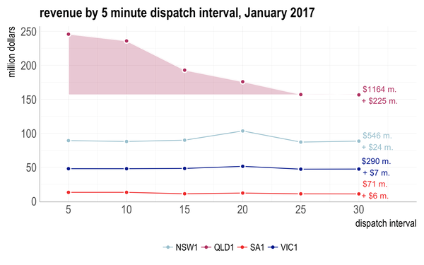
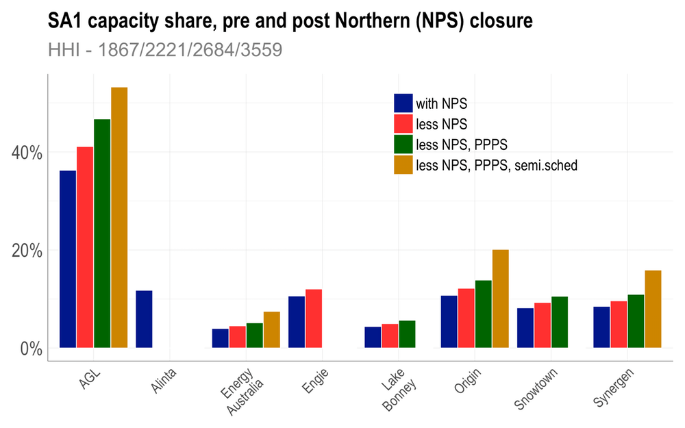

```{r setup, include=FALSE}
knitr::opts_chunk$set(echo = FALSE)
```

_In the third in my series on the crisis besetting the National Electricity Market (NEM) in eastern Australia (see [Part 1](https://theconversation.com/the-anatomy-of-an-energy-crisis-a-pictorial-guide-part-1-71789) & [Part 2](https://theconversation.com/the-anatomy-of-an-energy-crisis-a-pictorial-guide-part-2-65206)), I look at some evidence for how the market itself has played a role and specifically market power issues._

The recent troubles in  our electricity market are well documented.  As described in my earlier pieces in this series,  two elements have focused the attention of our political masters and industry groups.

The first is the question of security,  highlighted most dramatically by recent "black outs" in  South Australia.

The second is the question of price, with both wholesale and contract market prices having risen dramatically across most regions in recent times but nowhere quite as dramatically as in Queensland  (note that retail prices have also been rising as highlighted by the recent [Grattan report](https://grattan.edu.au/report/price-shock/)).

As discussed in Part 2, the tightening of the demand-supply balance in Queensland in response to an additional ~800 megawatt load from the massive CSG field developments and LNG export processing facilities [partly explains the rise in wholesale or pool prices there](https://theconversation.com/the-anatomy-of-an-energy-crisis-a-pictorial-guide-part-2-65206), but it is far from the full explanation. 

Lurking in the details are issues to do with the very functioning of the market, and the exercise of market power by large generators who are able to exploit [_monopoly rents_](https://en.wikipedia.org/wiki/Economic_rent#Monopoly_rent). 

## Concentrated power

As shown below, ownership  of generation assets across the NEM is  very concentrated.  AGL is the  dominant player  in New South Wales, Victoria  and South Australia, while the state owned Stanwell and  CS Energy command  almost 70% of Queensland generation capacity.

<image id="161678" align="centre" caption="Percentage market share by participating companies in each of the four mainland regions  in the NEM.  The blue show percentages of both _scheduled_ and _semi-scheduled_ generation, while the red shows percentage share of scheduled generation alone. _Semi-scheduled_ generation includes intermittent generators such as wind generators.  The notional value of the HHI, shown in the title  of each panel for scheduled plus semi-scheduled generation(left), and for scheduled generation alone (right), is a standard measure of market concentration (note that the up-to-date trading rights for generator outputs are  not in the public domain, so the HHI's may in fact be higher than quoted here). Note that in South Australia the market concentration increases appreciably as wind output declines, while in Victoria it declines marginally. Queensland has no wind generators.  Only the five largest generators for each region are shown." zoomable="true" />

The [Herfindahl-Hirschman index](https://en.wikipedia.org/wiki/Herfindahl_index) (HHI) is a commonly used measure of market concentration given by summing the squares of the percentage market shares for all participating firms.
A HHI  of 10,000 is equivalent to a 100% share, and represents complete monopoly. A HHI  of 2000 is used by the Australian Competition and Consumer Commission (ACCC) to flag competition concerns.
The UK’s Office of Gas and Electricity Markets (OFGEM) regards an HHI exceeding 1000 as concentrated and above 2000 as very concentrated. With a current HHI value of 1243, the OFGEM considers the UK wholesale electricity market somewhat concentrated.

With notional HHI's in the range ~1800-2600,  the regions of the NEM vary between somewhat (VIC1) to very  (QLD1) concentrated. Queensland  is  a particular  issue since the two  dominant  generation entities, Stanwell and CS Energy, are both state-owned. As shown below, aggregating them yields an effective HHI of  ~5000,  which amounts to extreme market power.

<image id="161425" align="centre" caption="Queensland market share, when state owned enterprise (Stanwell and CS Energy) are aggregated. The implied HHI of ~5000 intimates the potential for extreme market power of state-owned assets. " zoomable="true" />

The impact of intermittent wind generation,  or _semi-scheduled_ generation in NEM-speak, on market power depends on the structure of assets held by  participants. In  South Australia the  HHI rises in times of low  output because AGL holds a relatively minor proportion of that region's wind assets. Contrawise, it declines in Victoria because AGL holds a much higher proportion of the total wind assets. 

Interconnection serves to reduce  market  power, by allowing  more competitive pressure. For example,  the 650 MW  Heywood interconnector between  South  Australia  and Victoria helps  ameliorate  market concentration issues. This is  especially important for the relatively small market of South Australia, though perhaps  not as much as  might be  possible, given AGL holds the dominant market share in both regions.

As  discussed further below, recent and proposed closures of coal fired power stations, such as  Alinta's Northern Power Station in South Australia and  Engie's Hazelwood Power Station in Victoria, have or will effect more  concentrated market power.

## A rule change
As described in the Part 1,  the NEM  is designed to signal changes in the  balance of demand and supply via spot prices.  But how much the prices respond is very dependant on the level of competition. 

Recent experience of market participants flouting the spirit of the rules shines a light on  competition issues  and highlights a rather obvious, if somewhat trite, reality. That is, _the benefits of competitive markets can only flow if markets are competitive_.

The exercise of market power has been a perennial issue in the NEM. It is the role of the Australian Energy Market Commission (AEMC) to set the rules that allow for safe operation of the electricity network, and efficient operation of the market. It is the job of the Australian Energy Regulator (AER) to do the enforcing, while  AEMO operates the market.

The AEMC periodically adjusts rules so  as to  minimise the impact of perceived or real anti-competitive behaviour. It did so most recently in  December 2015 with the _[Bidding in Good Faith](http://www.aemc.gov.au/Rule-Changes/Bidding-in-Good-Faith)_ rule amendment because, to quote:

>... The Commission considers that the current rules do not set adequate boundaries on the ability of some participants to influence price outcomes to the detriment of others. This is not reflective of an efficient market.


The  statement "ability ... to influence price outcomes" is key. It expresses AEMC's concern that some participants have sufficient market power to extract so-called _monopoly rents_.

To fulfil my aim of providing a _pictorial guide_ to the market power issues that motivated the rule amendment, it's advisable (but probably not essential) to delve into the details of two intervals on which the market operates more so than discussed in [Part 1](https://theconversation.com/the-anatomy-of-an-energy-crisis-a-pictorial-guide-part-1-71789). The two intervals  are the five minute _dispatch interval_ and the  half hour _trading interval_.

## Some arcane detail

_(Warning,  do skip to the next section if you would prefer to pass on the detail, as it is technical! It provides the  background to why lines should be horizontal on the graphs discussed below, and the significance when they deviate)._

The five minute _dispatch interval_ is where the physics of the power system (balancing supply and demand in real time) meets the economics of the market (serving  demand at minimum cost). Functionally, our energy market operates by pooling offers from generators and allocating dispatch for each five minute interval in order of increasing offer price. 

A _generator offer_ specifies the price and quantity of electricity that will be supplied in a given trading interval, if needed. The dispatch price is set by the last (highest-price) offer needed to meet the _dispatch interval_ demand. All generation dispatched receives the same dispatch price, regardless of the offer price. Offers at prices above the dispatch price are not needed and so receive nought. To ensure a slice  of action, theory
has it that generators will offer the majority of their capacity at their short run marginal cost, at prices like is shown for Victorian generators in the figure below.
 

<image id="160908" align="centre" caption="Short run marginal cost of Victorian generators, stacked from left to right in _merit order_ of increasing marginal cost. The x-axis shows the cumulative nameplate capacity of the lowest cost power plants in megawatts. Because renewables such as wind have zero fuel cost they stack on the left side of the merit curve. Gas  and diesel generators with high fuel costs stack on the right. Image by Dylan McConnell." zoomable="true"/>

In practice, individual generators apportion their capacity into a range of price bands. They are then allowed to rebid some capacity into different price bands at short notice allowing adjustments to unforeseen circumstances that periodically arise. AEMC's  _Bidding in Good Faith_ rule amendment requires a justification for any late rebidding  within 15 minutes of the start of the relevant _dispatch interval_.

The second interval is the half-hour _trading interval_ or settlement period, across which dispatch prices are averaged to obtain a spot or settlement price, so called because it is the period on which financial payments are settled. 

Since demand normally varies only slightly across a given half hour _trading interval_ there should be little difference in the dispatch prices across the six corresponding _dispatch intervals_, especially when averaged over many such intervals. In an efficient market with generators offering the bulk of their capacity at near their short run cost, this _trading interval_ averaging should not materially affect the financial outcomes of the market.  

The figure  below provides an illustrative case. It shows the dispatch prices for each dispatch interval averaged across January 2016.  The   narrow range of variation, and flat trace, meets the expectation of a well functioning market.

<image id="160676" align="centre" caption="Average  prices  for  each of the 5 minute _dispatch intervals_ that make up the half hour settlement price for January, 2016. Prices are relatively constant across all intervals as expected in a well-behaved market, trading in an interval of about $10-15 per megawatt hour, for all four regional markets that define the mainland part of the NEM. Note the period is the month following the _Bidding in Good Faith_ rule amendment by the AEMC in December 2015, The good behaviour of the QLD1 market contrasts strongly with  the same periods in the previous and following years as shown in the following diagrams." zoomable="true" />

As revenues  are the product of price and demand, their graph should similarly trace a flat line across the dispatch intervals, as it did for January 2016.

<image id="161078" align="centre" caption="As for above but showing revenues rather than prices. The lower revenue for SA1 reflects its much smaller dispatch, compared to NSW1, QLD1 and VIC1. The numbers on the right correspond to the total market revenue for the month, and (marked with a +) the anomalous revenue given by the sum of the  differences between the dispatch prices and the lowest average dispatch price." zoomable="true" />

In a deregulated market like the NEM, optimal bidding is ensured primarily by the discipline of competitive forces. By preventing profiteering or gaming, it is that discipline that should ensure the lines in these figures lie flat. It goes without saying, that without adequate competition, there can be no such insurance, and one of the signals can be found when plots like these deviate from horizontal.  Then, the only recourse is to impose rules on the market.  The period  shown in  the figures above  are for the  first month following AEMC's _bidding in good  faith_ rule amendment.

##  Why two intervals?

While the existence of a five-minute _dispatch interval_ is essential to balance demand and supply in real time, there is no compelling  reason for the exercise of a half-hour _trading interval_, it being something of a historical artefact. Interestingly, judging by  [submissions](http://www.aemc.gov.au/Rule-Changes/Five-Minute-Settlement) to a current proposed rule change that would dispense the _trading interval_,  operators of our large generators seem to love it.

Why so?  The cynic would say because the existence of the two intervals affords a convenient guise to engage in profiteering. For example, by rebidding capacity into higher price bands late in a _trading interval_, pool prices can be raised significantly. While such a material distortion of the market would only immediately impact un-contracted customers trading directly on the  wholesale market, as explained in [Part 1](https://theconversation.com/the-anatomy-of-an-energy-crisis-a-pictorial-guide-part-1-71789) any sustained price impact will pass through the contract markets thereby eventually affecting all customers.  

##  So where is the evidence?

Do some participants engage in such profiteering?  Well the AEMC certainly thought so, enough at least to  amend the _Bidding in Good Faith Rule_ in December 2015.  

The AEMC was particularly concerned that such practices were impacting  market outcomes in Queensland. The smoking gun lies deeply buried in the gory details of the offers and rebids, as  documented in [AER's "State of the energy market 2015" report on page 49](https://www.aer.gov.au/system/files/State%20of%20the%20energy%20market%202015%20%28A4%20format%29%20–%20last%20updated%204%20February%202016.pdf).  But the pointers are quite apparent in the figures below which cover the  month of January in 2015,  prior to  the AEMC's rule amendment.   They show the prices and the revenue by the five minute _dispatch interval_ .  The striking feature is the asymmetry in Queensland (QLD1) price and revenue distribution, increasing very substantially across the last two _dispatch intervals_, compared with the earlier intervals. As explained above, the distribution should be flat, like it is for the other states in January 2015. 

<image id="161074" align="centre" caption="Average  prices  for  each of the 5 minute _dispatch intervals_ that make up the half hour settlement price for January, 2015. Note the  elevated and much more skewed distribution for QLD1, with prices in the last two dispatch intervals much higher than the earlier intervals. Their is no such anomalies in the other states which are operating in accordance with expectation." zoomable="true" />

A crude estimate of the excess revenue generated by the anomalous market behaviour in Queensland is given by the shaded area in the _revenue verse dispatch interval_ plot below. As noted on the right, it amounted to some 30% of total market value, or ~ $200 million across the month.

<image id="161015" align="centre" caption="Average wholesale markets revenues for 5 minute _dispatch intervals_ for January, 2015. The numbers on the right correspond to the total market revenue for the month, and (marked with a +) the anomalous revenue given by the sum of the  differences between the dispatch prices and the lowest average dispatch price, shown by the shaded area. The latter is a guide to distortion that can be attributed to noncompetitive market forces - about $200 million, or 30%, for QLD1 in this case." zoomable="true" />


By these metrics the magnitude of the Queensland anomaly is astounding, amounting to ~150% of the total revenue in the similarly sized Victorian market and adding as much as $40 per megawatt hour to Queensland spot over the month.  The AEMC interest in a rule change is hardly surprising. To my mind they were a little conservative. To quote from AEMC's rule determination:

> ... the price volatility that arises from deliberately late rebidding ... [is] ... estimated to have added around eight dollars per megawatt hour to the price of caps in Queensland in the final quarter of 2014, and around seven dollars per megawatt hour in the first quarter of 2015. Across the market, this represents additional expenditure of approximately $170 million.

Whatever the final accounting, Queensland customers should have been outraged. In conclusion the AEMC noted 

> ... While it is not guaranteed that the changes to the rules will put an immediate stop to the conduct of concern, they are a proportionate response to the issue, and ought to make it easier for the AER compared to the current arrangements to take enforcement action in respect of deliberately late rebidding. At the same time, they should not prevent rebidding in legitimate pursuit of commercial interests.

Should we ask did it do so? 

The answer is shown in the figures below, for January 2017. Essentially they are the mirror image of the January 2015 scenario, seemingly implying Queensland generators are now initially bidding in capacity into elevated price bands in the early dispatch intervals. Whatever the strategy it is achieving an almost identical outcome to 2015. Even if entirely within the rules, it would seem not in the spirit. The substantive result is situation normal for Queensland customers, with a $225 million monopoly rent extraction for this past January accompanying [unprecedented spot price rises](https://theconversation.com/the-anatomy-of-an-energy-crisis-a-pictorial-guide-part-2-65206). 

<image id="161073" align="centre" caption="Average  prices  for  each of the 5 minute _dispatch intervals_ that make up the half hour settlement price for January, 2017." zoomable="true"/>


<image id="161017" align="centre" caption="Average wholesale markets revenues for 5 minute _dispatch intervals_ for January, 2017. It is notable that it is almost the mirror image of January 2015  shown above, an example of creative compliance by Queensland generators following AMEC's _Bidding in Good Faith_ rule amendment of December 2015. Note also the almost doubling of January revenues since 2015. The shaded area represents the $225 million monopoly rent extraction foisted in Queensland customers in January. Annualised that amounts to a whopping $2.7 billion." zoomable="true" />

## Concentrating power

There is such a lot to be said about this, and hopefully it will be.  Queensland customers should be beyond outrage. The analysis provided above is but one, easily illustrated  example of the exercise of market power. There are others, as for example described in the notes below [2]. From the perspective of this discussion it is illustrative of significant deficiencies in the current operation of the NEM. Those deficiencies are exacerbating our current energy crisis.  A concentration of market power is adding materially to costs especially, but not only, in Queensland.

It is worth noting that the  [half-hour settlement period is currently under review by AEMC](http://www.aemc.gov.au/Rule-Changes/Five-Minute-Settlement) and, against the wishes of most established operators, will likely be scrapped [1].  Whatever is decided by AEMC, the underlying issue of market power cannot be addressed by tinkering with the rules. The concentration of market power is  increasing as old power stations such as Alinta's Northern Power Station in South Australia and Engie's Hazelwood Power Station in Victoria are closed.  For example,  following closure of Northern, AGL's proportion of registered capacity in South Australia increased  5% points, from 36% to 41%, improving its relative market power by more than 10%.  
 
 

  
```{r fig.cap="Percentage of registered generation capacity by participant in South Australia, both before (blue) and after (red) the closure of the Alinta's Northern Power Station (NPS). Also shown in green is the effect of mothballing Engie's Pelican Point Power station PPS) as it was in winter 2016. Orange shows the percentages less NPS, PPPS and semi scheduled generators (wind), as applied on July 7th, 2016. In both instances AGL's relative market power  has substantially increased by these events, by over 10% in relative market power terms.  This increases the likelihood of AGL being a necessary or _pivotal_ supplier, as it's was in July 7th in the first of the South Australian energy crises of last year as described briefly in note [2]. Only the largest eight participants are shown." }

```


Following the closure of Northern, as well as the decision by Engie to _mothball_ the Pelican Point Power Station, AGL played its hand ruthlessly during the first of the South Australian energy crises in July 2016  [2]. With the closure of Hazelwood in a few weeks,  AGL will again be the beneficiary of increased market share in Victoria.  Although not to the extent  it was in South Australia, it will increase the likelihood of AGL being a necessary or _pivotal_ supplier in future high demand events in Victoria. How AGL responds will be a key to how steeply prices rise in Victoria and neighbouring states. 

 

```{r fig.cap="Percentage of registered generation capacity by participant in Victoria ), both before (blue) and after (red) the closure of Engie's  Hazelwood Power Stations (HPS), respectively. Orange shows the percentages less HPS and semi scheduled generators(wind). Note that Hazelwood is still operational at the time of writing, but is scheduled to close at end of this month (March, 2017). AGL's relative market power will be substantially improved by these closures, by over 10% in relative market power terms. In OFGEM's terms the Victorian market power increases from _somewhat concentrated_ to _exceedingly concentrated_. This increases the likelihood of AGL being a necessary or _pivotal_ supplier. Only the largest seven participants are shown."  }

```


## Some reflections

A key objective of the NEM's _energy-only_ market is to bring competitive pressure to bear on wholesale prices. Until recently the NEM was performing quite well in this regard, with wholesale prices and volatility being very low in the period 2009-2014 in historical terms (see [Part 2](https://theconversation.com/the-anatomy-of-an-energy-crisis-a-pictorial-guide-part-2-65206)). But this has changed over the last few years, with a tightening of the market. Like with any industry, our electricity generators have shown adeptness at exploiting the opportunities availed by the market rules. Because of the concentrated nature of the market they have been able to influence price outcomes beyond what would be expected for an _efficient market_ response to such tightening. In so doing they are helped provoke the current energy crisis. 

One could only wish our generators turned such "adeptness" to helping drive our energy system to a place we need it to be, that is _secure, affordable and with much, much lower emissions_. To be so guided, our market rules will have to be radically reshaped to be more aligned to the national interest,  explicitly including all three elements of our _energy trilemma_, and  ensuring adequate levels of competition allow the benefits of the deregulated market flow to all participants.

Sadly, as our energy crisis has unfolded, partly in response to the need to address its emissions intensity, emissions have begun to rise again. Just by how much we do not know, as I will discuss in the next piece in this series.

---
Notes

[1] As [Dylan McConnell has shown](http://www.aemc.gov.au/getattachment/1d460acc-dbe2-45ea-bb4e-1903161d90f1/Melbourne-Energy-Institute.aspx), the current rules also seriously disadvantage the economics of a number of emerging technologies such as battery storage, hindering innovation that would serve  much needed competitive discipline into the market.

[2] For example, on page 51 of its [ "State of the energy market 2015" report ](https://www.aer.gov.au/system/files/State%20of%20the%20energy%20market%202015%20%28A4%20format%29%20–%20last%20updated%204%20February%202016.pdf), the AER documents the role of Snowy Hydro's _strategic bidding_ of its Angaston plant in South Australia on June 10th 2015 to manipulate price. In [our analysis](http://energy.unimelb.edu.au/library/winds-of-change-an-analysis-of-recent-changes-in-the-south-australian-electricity-market) of the July 7th event in South Australia, we analysed the extent to which AGL bid capacity to high price bands (typically the market cap price) for the Torrens Island A Power Station. We also looked at the proportion of capacity that was available below and above $300/MWh. In aggregate, Torrens Island A offered its entire capacity to the market at less than $300/MWh 96.5% of time in 2015. For the remaining 3.5% of the year (or about 300 hours) some capacity was pushed into high price bands.
Our analysis shows a correlation between periods of high scheduled demand and Torrens Island A’s bidding of capacity into high price bands. The proportion of time when some capacity was priced above $300/MWh is clearly skewed to times of high scheduled demand. In 2015, for the top 10% of scheduled demand periods, the amount of time some capacity was bid into these high price bands was 16.7%. For the top 1% of scheduled demand periods it increased to 35%. On July 7th 2016, it is clear is that Torrens Island had bid an unusually high volume of capacity at the market price cap, at a time it was needed to ensure supply as a _pivotal supplier_, consistent with exercising market power. While there is nothing in the rules to prevent this, the lack of appropriate _competitive discipline_ means significant market distortion accumulated.