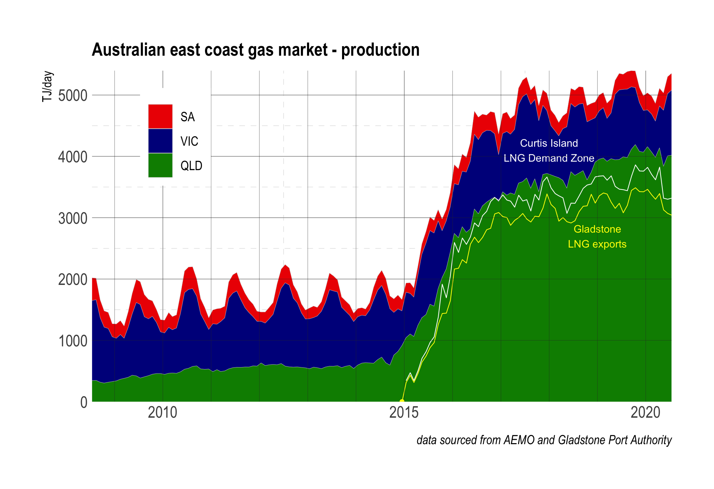

 

```{r setup, include=FALSE, cache =T}

# invalidate cache when the package version changes
knitr::opts_chunk$set(tidy = FALSE, cache.extra = packageVersion('tint'))
options(htmltools.dir.version = FALSE)

#extrafont::loadfonts()

update=FALSE
plots=FALSE
do_save=FALSE
blog.dir<- getwd()
gas.dir<-"/Volumes/data/Dropbox/msandifo/documents/programming/r/2020/gasbb/"
setwd(gas.dir)
source("r/setup.R")
plots=TRUE
 source("r/wall_price_plots.R")
 #source("r/wall_flow_plots.R")
 source("r/lng_prod_plots.R")
source("r/rmd.R")


theme_set(  hrbrthemes::theme_ipsum(base_size = 20, base_family = "Roboto Condensed"))
 

theme_replace(
  panel.grid.minor = element_line(
    size=.1,
    linetype=2,
    colour="grey80"
),
  plot.title= element_text(
 
   
    face="bold",
    hjust=0,
    vjust=1,
    margin= unit(c(0,0,8,0), "pt")),
  panel.grid= element_line(
    size=.1,
    colour="grey80"
  )
)

r10 <-function(val) round(val/10)*10

setwd(blog.dir)
```

```{marginfigure}  
  \linebreak \begin{flushright}
   \it{... and so, if gas is critical for industrial recovery, why waste it heating houses?}
     \end {flushright}
   
```

\noindent _"Over half of Australians still rely on gas as a source of energy, but few realise that there’s a more cost-effective, energy-efficient option – heat pumps"_ [AGL](https://discover.agl.com.au/your-home/heat-pumps-why-are-they-more-efficient/)

---

<!-- \noindent _"so, if gas is critical for industrial recovery, why waste it heating houses?"_ our view -->

<!-- --- -->
 

\noindent With traditional east coast gas reserves in decline^1^, industry and government argue new gas supply from the  likes of Narrabri^2^ or import terminals is _essential_ for post-COVID industrial recovery. Lead-times on new production mean addressing allocation  is likely to secure more supply in the short-term. As much is recognized in the federal government's  ADGSM^3^, which   delivers about ~200 TJ/day each year. Here we address the broader issue of allocation by asking to what extent can non-critical fuel switching  - _gas to electricity_ -  help alleviate supply issues?
Despite the ADGSM, LNG exports have seen a substantial diversion of Queensland CSG production away from domestic markets. We argue that fuel switching together with reservation of a small fraction of CSG production, in line with pre-2015 levels,  can substantially alleviate _critical industrial gas supply_ issues with significant additional benefits. We provide two policy prescriptions

```{r fig-dom, echo=FALSE, fig.cap="East Coast gas production by region",  cache=FALSE}

```
> __PP 1. Switch ~50% of the current Victorian domestic and commercial gas heating demand to elecricity
delivering an additional ~180 TJ/day above 2019 levels to domestic markets__

> __PP 2. Reserve a minimum  550 TJ/day from Queensland CSG production delivering an additional 170 TJ/day  above 2019 levels to domestic markets__

<!-- are we using the available domestic gas wisely?_  -->
\noindent  Together, PP1 and PP2  more than compensate the looming  330  TJ/day Victorian committed  supply deficit^1^ with each contributing almost as much as Narrabri. We note that  fuel switching is implicit in  our _Paris commitments_, and is an obligation. 

# how is east coast gas currently allocated?

```{r fig-balance,   cache=TRUE, echo=FALSE, fig.cap="East Coast gas production by region less allocations to the Curtis Island  Demand zone used for LNG export."}

```
In 2019, total east coast gas  production  averaged ~`r r10(total.prod.2019)` TJ/day of which `r r10(total.glad.2019)` TJ/day was allocated to LNG exports (`r  glad.p `%) and about `r r10(total.ci.2019 -total.glad.2019)` TJ/day (`r ci.p-glad.p`%) to LNG processing at Curtis Island, leaving a balance of about `r r10(total.prod.2019 -total.ci.2019)` TJ/day
<!-- ^[cf. ~1760 TJ/day across 2010-2014]   -->
(`r 100- ci.p`%) for the domestic market.    CSG production in Queensland  accounted for `r round(100*total.prod.qld.2019/total.prod.2019)`% of total production (~`r r10(total.prod.qld.2019)` TJ/day), of which `r round(100-100*total.ci.2019 /total.prod.qld.2019 )`% (~`r r10(total.prod.qld.2019 - total.ci.2019)` TJ/day) was allocated to the domestic market. This compares to the average of `r total.prod.qld.p2015 <- mean(total.prod.qld.year$supply[total.prod.qld.year$year<=2013 &total.prod.qld.year$year>=2010]); r10(total.prod.qld.p2015)` TJ/day from CSG in the period 2010-2013, prior to the first LNG exports in 2015. In effect, notwithstanding the impact of the ADGSM, some 180 TJ/day has been diverted from Queensland domestic supply to LNG export. Of the domestic allocation industry uses ~45%, domestic and commercial heating ~32%, power generation ~23%.   In Victoria, 55% of demand is for domestic  and commercial heating, 30% for industry and 15% for power. 

```{r fvid-prod, cache=TRUE, echo=FALSE, fig.cap="Victorian gas production showing strong seasonality averaging about 910 TJ/day."}
 
knitr::include_graphics('images/vic.prod.png')

```

<!-- Victorian industrial demand averages about 190 TJ/day, with domestic and commercial demand for heating averaging 350 TJ/day. Victorian gas power generation demand averages ~100 TJ/day for electrical power generation with a further ~260 TJ/day exported to NSW and SA  -->
# alternatives to new supply?

 We consider two alternatives to new supply: _fuel-switching_ of domestic heating loads and _reservation_. 
With [efficient electrical heat-pump](https://discover.agl.com.au/your-home/heat-pumps-why-are-they-more-efficient/) alternatives such as reverse cycle air-conditioners now widely available, fuel switching of heating loads is now plausible.
<!-- should we still be using such a _critical resource_ for domestic heating?   -->
 Fuel switching of ~50% of Victorian  gas heating demand  saves about 180 TJ/day.
 Reserving CSG production at the 2010-2013 average delivers an additional 170 TJ/day to domestic markets equivalent to an additional  `r round(170/total.ci.2019*100 )`% of  export demand. Gas use in LNG processing can  be substantially electrified and therefore contribute materially to the domestic market supply balance. At ~80 TJ/day, electrifying 25% of LNG processing demand would contribute about half the additional required PP2 CSG reservation.

```{r fvid-demand, fig.margin=TRUE, out.width='100%', cache=TRUE, echo=FALSE, fig.cap="Victorian gas allocation to domestic and commercial sectors mainly for heating."}

```

# where would the additional energy come from?

\noindent Switching  50% of  the Victorian gas heating load to heat pumps, adds about 2.0 GW to Victorian peak winter power demand^5^, with the total annual demand requirement equivalent to the output of about 1.5 GW of installed wind power assuming a capacity factor of 35%.

# with added benefits 

* for households, the possibility of just one connection fee instead of two saving around $350/year
* for gas transmission, mitigation of looming winter _peak day adequacy_  issues^6^
* for electricity consumers, a more productive power grid (~6% higher utilisation) with reduced unit costs, and reduced incentives for gaming by market participants through practices such as _shadowing gas prices_^7^ 
* for investors, further incentives for renewable power generation
* for Australians, time for the hydrogen/alternative economy to arrive without costly supply-side investments and their associated risks

 

# 2019 gas allocation and supply data
 
* total east coast gas demand, excluding LNG ~`r r10(subset(total.prod.year, year==2019)$supply -total.ci.2019)` TJ/day 
* Queensland CSG production ~`r r10(total.prod.qld.year$supply[total.prod.qld.year$year==2019])`  TJ/day
* Victorian gas production ~`r r10(total.prod.vic.year$supply[total.prod.qld.year$year==2019])`  TJ/day
* total east coast industrial gas demand, excluding LNG ~720 TJ/day
* Victorian domestic and commercial gas heating  ~360 TJ/day
* LNG exports ~`r r10(total.glad.2019)` TJ/day
* LNG processing ~`r r10(total.ci.2019 - total.glad.2019)` TJ/day
```{r shadow-price-1, fig.margin=TRUE, out.width='100%', cache=FALSE, echo=FALSE, fig.cap="Wholesale electricity prices doubled as LNG exports increased across 2016, adding 14 billion to the traded value substantially due to the practice of shadowing the gas price."}
knitr::include_graphics('images/p001_01.png')
```
---

\footnotesize

1. For example, the currently committed supply from Victoria's Gippsland Basin declines by 37% or about 330 TJ/day by 2024.
2. The SANTOS Narrabri project will deliver about 190 TJ/day in new supply.
3. The [ADGSM](https://www.industry.gov.au/regulations-and-standards/australian-domestic-gas-security-mechanism) is a government scheme  to ensure uncontracted gas from LNG exporters is made available to domestic markets - in effect a veiled _domestic reservation scheme_,  delivering about  ~200 TJ/day in 2019.
4. LNG processing demand is measured as the total Curtis Island demand, less LNG exports assuming an energy content of LNG of 54.8 GJ/tonne, and amounts to ~9% of LNG export volume.
5. assuming a gas heat efficiency of 75% and a heat pump  COP~3
5. _Peak day adequacy_ issues are forecast in AEMO's March 2020 [Victorian Gas Planning Report Update](https://aemo.com.au/en/energy-systems/gas/gas-forecasting-and-planning/victorian-gas-planning-report)
6. the exercise of market power through _shadowing the gas price_  impacted the wholesale electricity price in 2017 by as much as ~$14 billion.
